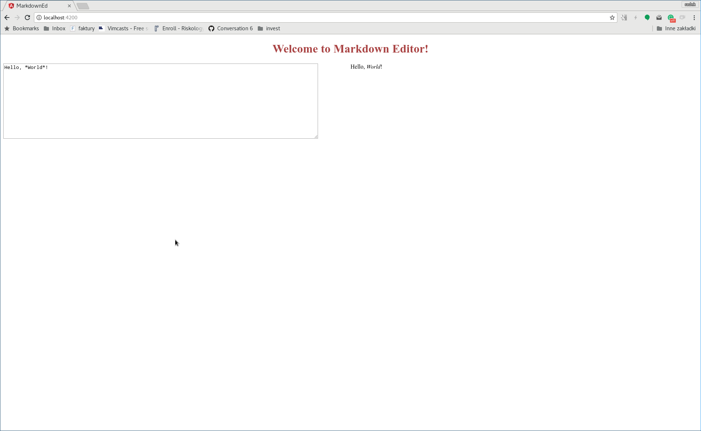
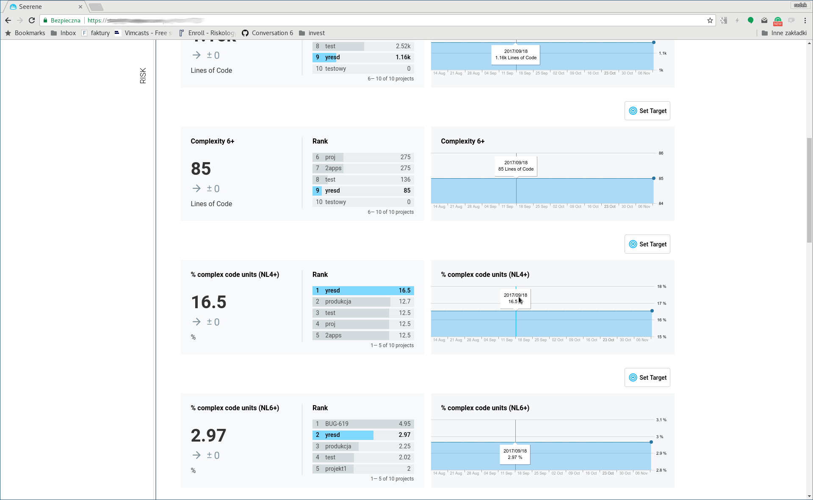

class:  middle

# Angular 2/4/5 
**Radosław Kintzi**<br>
@rkintzi


---

# Agenda

0. Introduction

1. Angular CLI 

2. Components

3. Templates

4. Component interaction

6. Change detection

4. Services and DI

5. Hierarchical injector


---

class: middle

# Introduction

---

# What we gonna build today



---

# How will we work


---

# How will we work

* few minutes of my talking

* a task to do

* review and my solution

---

# How will we work

* few minutes of my talking

* a task to do

* review and my solution

---

class: middle

# Angular CLI

---

# Angular CLI 

http://cli.angular.io/

Command line utility for Angular

```
> npm install -g @angular/cli
> ng new my-super-app
> cd my-super-app
> ng serve
```


---

# Angular CLI 

http://cli.angular.io/

Command line utility for Angular

```bash
> npm install -g @angular/cli
> ng new my-super-app
> cd my-super-app
> ng serve
```

<br>


```bash
> ng generate component MyComponetName
> ng generate service MyService
> ng test
> ng build
```

---

# Task #1

(If you haven't done yet)

---

# Task #1

(If you haven't done yet)

```bash
> git clone http://github.com/rkintzi/a4intro
> cd a4intro
> npm install
```

---

# Task #1

(If you haven't done yet)

```bash
> git clone http://github.com/rkintzi/a4intro
> cd a4intro
> npm install
```

<br>

```bash
> export PATH=`pwd`/node_modules/.bin:$PATH
```

```bash
> npm install -g @angular/cli
```

---

# Review #1
What was generated for us?

---

# Task #2

1. On first console run:

    ```bash
    > ng serve
    ```
2. Open a browser `http://localhost:4200`

3. On second console run:

    ```bash
    > ng test
    ```

---

# Review #2

---
class: middle

# Components

---

# Components

* Building blocks you compose UI from

* Consist of template, controller, and styles

* React on user interactions

* Communicate each other to provide complex look and feel 

---

# First Component

```ts
import { Component, OnInit } from '@angular/core';

@Component({
  selector: 'app-editor',
  templateUrl: './editor.component.html',
  styleUrls: ['./editor.component.css'],
})
export class EditorComponent {


    constructor(public editorState: EditorStateService) {
    }

}
```
---

# Task #3

1. Generate `EditorComponent` with:

    ```bash
    > ng generate component EditorComponent
    ```

2. Write a template and CSS stylesheet so the component provides a two-column layout for our editor

3. Columns should contain nothing but simple strings: "Left column" and "Right
   column"

4. Make use of the new component in the app component 


---

# Review #3

```html
<div class="editor">
    <div>Left column</div>
    <div>Right column</div>
</div>
```

```css
.editor {
    display: flex;
    flex-direction: row;
}
.editor > * {
    flex: 1;
}
```
```html
<div>
  <h1 style="text-align:center">
    Welcome to {{title}}!
  </h1>
  <app-editor></app-editor>
</div>
```

---

# Review #3
   
To compare with a suggested solution:
```bash
> git diff task3
```

---

# Review #3

To compare with a suggested solution:
```bash
> git diff task3
```

To obtain the suggested solution:
```bash
> git reset --hard task3
```
---

# Task #4

1. Fix a test for the `AppComponent`

2. Write a test for the `EditorComponent`


---

# Review #4

1. Fix a test for the `AppComponent`

---

# Review #4

1. Fix a test for the `AppComponent`

    ```
    [ERROR ->]<app-editor></app-editor>
    ```


---

# Review #4

1. Fix a test for the `AppComponent`

    ```
    [ERROR ->]<app-editor></app-editor>
    ```

    `app.component.spec.ts`:
    ```ts
        TestBed.configureTestingModule({
          declarations: [
            AppComponent,
            EditorComponent,              // !!!!
          ],
        }).compileComponents();
    ```
---

# Review #4

1. Fix a test for the `AppComponent`

    ```
    [ERROR ->]<app-editor></app-editor>
    ```

    `app.component.spec.ts`:
    ```ts
        TestBed.configureTestingModule({
          declarations: [
            AppComponent,
            EditorComponent,              // !!!!
          ],
        }).compileComponents();
    ```

2. Write a test for the `EditorComponent`

    `editor.component.spec.ts`:
    ```ts
      it('should render columns', async(() => {
        const compiled = fixture.debugElement.nativeElement;
        expect(compiled.querySelectorAll('.editor div').length).toEqual(2);
      }));
    ```

---

# Review #4


```bash
> git diff task4
> git reset --hard task4
```

---

class: middle

# Templates

---

# Templates

```html
<div>
  <h1 style="text-align:center">
    Welcome to {{title}}!
  </h1>
  ...
```

---

# Templates

```html
<div>
  <h1 style="text-align:center">
    Welcome to {{title}}!
  </h1>
  ...
```

```html
<div *ngIf="name == 'Adam'">Hello Adam</div>
```

---

# Templates

```html
<div>
  <h1 style="text-align:center">
    Welcome to {{title}}!
  </h1>
  ...
```
```html
<div *ngIf="name == 'Adam'">Hello Adam</div>
```
```html
<div *ngFor="let user of users">Hello {{user.name}}</div>
```
---

# Templates

```html
<div>
  <h1 style="text-align:center">
    Welcome to {{title}}!
  </h1>
  ...
```
```html
<div *ngIf="name == 'Adam'">Hello Adam</div>
```
```html
<div *ngFor="let user of users">Hello {{user.name}}</div>
```
```typescript
@Component({
  selector: 'app-root',
  templateUrl: './app.component.html',
  styleUrls: ['./app.component.css']
})
export class AppComponent {
  title = 'Markdown Editor';
}
```
---
# Templates

```html
<div>
  <h1 style="text-align:center">
    Welcome to {{title}}!
  </h1>
  ...
```
```html
<div *ngIf="name == 'Adam'">Hello Adam</div>
```
```html
<div *ngFor="let user of users">Hello {{user.name}}</div>
```
```typescript
@Component({
  selector: 'app-root',
  templateUrl: './app.component.html',
  styleUrls: ['./app.component.css']
})
export class AppComponent {
  title = 'Markdown Editor';
  name = 'Meg';
  users = [{name: 'Eva'}, {name: 'Ann'}];
}
```

---
class: middle
# Component interaction

---

# Component interaction

`editor.component.html`:
```html
<div class="editor">
    <div>Left column</div>
    <div>Right column</div>
</div>
```

---

# Component interaction

`editor.component.html`:
```html
<div class="editor">
    <app-edit-area></app-edit-area>
    <app-preview></app-preview>
</div>
```

---

# Component interaction

`editor.component.html`:
```html
<div class="editor">
    <app-edit-area></app-edit-area>
    <app-preview></app-preview>
</div>
```

```typescirpt
@Component({
  selector: 'app-editor',
  templateUrl: './editor.component.html',
  styleUrls: ['./editor.component.css'],
})
export class EditorComponent {

  constructor() { }
}

```
---

# Component interaction

`editor.component.html`:
```html
<div class="editor">
    <app-edit-area></app-edit-area>
    <app-preview></app-preview>
</div>
```

```typescirpt
@Component({
  selector: 'app-editor',
  templateUrl: './editor.component.html',
  styleUrls: ['./editor.component.css'],
})
export class EditorComponent {

  editorState = 'Initial state';

  constructor() { }
}

```

---

# Component interaction

`editor.component.html`:
```html
<div class="editor">
    <app-edit-area></app-edit-area>
    <app-preview></app-preview>
</div>
```

---

# Component interaction

`editor.component.html`:
```html
<div class="editor">
    <app-edit-area [text]="editorState"></app-edit-area>
    <app-preview [text]="editorState"></app-preview>
</div>
```
---

# Component interaction

`edit-area.component.ts`:
```typescript
import { Component, Input } from '@angular/core';

@Component({
  selector: 'app-edit-area',
  templateUrl: './edit-area.component.html',
  styleUrls: ['./edit-area.component.css'],
  encapsulation: ViewEncapsulation.None
})
export class EditAreaComponent {

  @Input() text: string;

  constructor() { }

}
```
---

# Task #5

1. Generate `EditArea` and `Preview` components

2. Use new components in `Editor` component template and pass editor state to
   them

3. Write templates for new components (use `<textarea>` to allow enter text)
   and display editor state in both

4. Write CSS stylesheets (if needed)

5. Update existing tests


---

# Review #5

`edit-area.component.html`:
```html
<textarea>{{text}}</textarea>
```

`edit-area.component.ts`:
```typescript
@Component({
  selector: 'app-edit-area',
  ...
})
export class EditAreaComponent {

  @Input() text: string;

}
```
`edit-area.component.css`:
```css
textarea {
    width: 90%;
    min-height: 200px;
}
```

---

# Review #5

`app.component.spec.ts`:
```diff
-1,6 +1,12 @@
+import { Component } from '@angular/core';
 import { TestBed, async } from '@angular/core/testing';
 import { AppComponent } from './app.component';
-import { EditorComponent } from './editor/editor.component';
+
+@Component({
+    selector: 'app-editor',
+    template: '<div>mocked editor</div>',
+})
+class EditorComponent {}
 
 describe('AppComponent', () => {
   beforeEach(async(() => {
    TestBed.configureTestingModule({
      declarations: [
        AppComponent,
        EditorComponent,
      ],
    }).compileComponents();
  }));
```

---

# Review #5

`app.component.spec.ts`:
```typescript
  it('should render markdown editor', async(() => {
    const fixture = TestBed.createComponent(AppComponent);
    fixture.detectChanges();
    const compiled = fixture.debugElement.nativeElement;
    expect(compiled.querySelector('div').textContent)
          .toContain('mocked editor');
  }));
```

---

# Review #5

`editor.component.spec.ts`:
```diff
@@ -6,9 +7,33 @@ describe('EditorComponent', () => {
   let component: EditorComponent;
   let fixture: ComponentFixture<EditorComponent>;
 
+  let editAreaText: string;
+  let previewText: string;
+
+    @Component({
+        selector: 'app-edit-area',
+        template: '<div>mocked edit area</div>',
+    })
+    class EditAreaComponent {
+        @Input() set text(val: string) { editAreaText = val; }
+    }
+
```
---

# Review #5

`editor.component.spec.ts`:
```typescript
    beforeEach(() => {
        fixture = TestBed.createComponent(EditorComponent);
        editorComponent = fixture.componentInstance;
        fixture.detectChanges();
    });

    it('should pass editor state to editor area', () => {
        editorComponent.editorState = 'edited text';
        fixture.detectChanges();
        expect(editAreaText).toEqual('edited text');
        expect(previewText).toEqual('edited text');
    });
```
---

# Review #5

`editor.component.spec.ts`:
```diff
   beforeEach(async(() => {
     TestBed.configureTestingModule({
-      declarations: [ EditorComponent ]
+      declarations: [
+          EditorComponent,
+          EditAreaComponent,
+          PreviewComponent,
+      ]
     })
     .compileComponents();
```

---

# Review #5

```bash
> git diff task5
> git reset --hard task5
```

---
class: middle
# Component interaction 

---

# Component interaction

`editor.component.html`:
```html
<div class="editor">
    <app-edit-area [text]="editorState"></app-edit-area>
    <app-preview [text]="editorState"></app-preview>
</div>
```

---

# Component interaction

`editor.component.html`:
```html
<div class="editor">
    <app-edit-area 
        [text]="editorState" 
        (textChange)="editorState = $event"
    ></app-edit-area>
    <app-preview [text]="editorState"></app-preview>
</div>
```

---

# Component interaction

`editor.component.html`:
```html
<div class="editor">
    <app-edit-area 
        [text]="editorState" 
        (textChange)="editorState = $event"
    ></app-edit-area>
    <app-preview [text]="editorState"></app-preview>
</div>
```
```html
<div class="editor">
    <app-edit-area [(text)]="editorState"></app-edit-area>
    <app-preview [text]="editorState"></app-preview>
</div>
```

---
# Component interaction

`edit-area.component.ts`:
```typescript
import { Component, Input, Output, EventEmitter } from '@angular/core';

@Component({
  selector: 'app-edit-area',
  templateUrl: './edit-area.component.html',
  styleUrls: ['./edit-area.component.css'],
  encapsulation: ViewEncapsulation.None
})
export class EditAreaComponent {

  @Input() text: string;
  @Output() textChange = new EventEmitter<string>();

  constructor() { }

}
```


---
# Component interaction

`edit-area.component.html`:
```html
<textarea>{{text}}</textarea>
```
---
# Component interaction

`edit-area.component.html`:
```html
<textarea 
    [ngModel]="text" (ngModelChange)="textChange.emit($event)">
</textarea>
```
---
# Component interaction

`app.module.ts`:
```diff
diff --git a/src/app/app.module.ts b/src/app/app.module.ts
index 69797f7..2621a01 100644
--- a/src/app/app.module.ts
+++ b/src/app/app.module.ts
@@ -1,4 +1,5 @@
 import { BrowserModule } from '@angular/platform-browser';
+import { FormsModule } from '@angular/forms';
 import { NgModule } from '@angular/core';
 
 
@@ -16,7 +17,8 @@ import { PreviewComponent } from './preview/preview.component';
     PreviewComponent
   ],
   imports: [
-    BrowserModule
+    BrowserModule,
+    FormsModule,
   ],
   providers: [],
   bootstrap: [AppComponent]
```
---

# Task #6

1. React on user input and propagate entered text from `Editor` component to
   `Preview` component

2. Update existing tests

---

# Review #6

---

# Review #6

```diff
--- a/src/app/edit-area/edit-area.component.spec.ts
+++ b/src/app/edit-area/edit-area.component.spec.ts
@@ -1,4 +1,5 @@
 import { async, ComponentFixture, TestBed } from '@angular/core/testing';
+import { FormsModule } from '@angular/forms';
 
 import { EditAreaComponent } from './edit-area.component';
 
@@ -8,7 +9,8 @@ describe('EditAreaComponent', () => {
 
   beforeEach(async(() => {
     TestBed.configureTestingModule({
-      declarations: [ EditAreaComponent ]
+      declarations: [ EditAreaComponent ],
+      imports: [ FormsModule ],
     })
     .compileComponents();
   }));
```
---
# Review #6

```bash
> git diff task6
> git reset --hard task6
```

---

class: middle

# Change detection

---
# Change detection

```typescript
import { Component, Input } from '@angular/core';

@Component({
  selector: 'app-preview',
  templateUrl: './preview.component.html',
  styleUrls: ['./preview.component.css'],
})
export class PreviewComponent {

  @Input() text: string;

  constructor() { }
}
```
```html
<div>
{{ text }}
</div>
```

---
# Change detection

```typescript
import { Component, Input, OnChanges, SimpleChanges } from '@angular/core';

@Component({
  selector: 'app-preview',
  ...
})
export class PreviewComponent implements OnChanges {


  @Input() text: string;


  constructor() { }
  
  ngOnChanges(changes: SimpleChanges) {
      if (changes['text']) {
         ...
      }
  }

}
```
---
# Change detection

```typescript
import { Component, Input, OnChanges, SimpleChanges } from '@angular/core';

@Component({
  selector: 'app-preview',
  ...
})
export class PreviewComponent implements OnChanges {

  private static re = new RegExp(/\*([^\*]*)\*/);
  @Input() text: string;
  formatted: string;

  constructor() { }

  ngOnChanges(changes: SimpleChanges) {
      if (changes['text']) {
          this.formatted = PreviewComponent.format(changes['text'].currentValue);
      }
  }

  private static format(text: string): string {
      return text.replace(PreviewComponent.re, '<em>$1</em>');
  }
}
```

---
# Change detection
```html
<div>
{{ text }}
</div>
```

---
# Change detection
```html
<div [innerHtml]="formatted"></div>
```

---
# Task #7

Translate Markdown in to html 

---
# Review #7

```bash
> git diff task7
> git reset --hard task7
```

---
class: middle
# Services and DI


---
# Services and DI

* Implemented (most often) as classes

* Instantiated by a framework 

* Injected into components and other services

* Used to share data between components

* Or to group utility functions 


---

# Services and DI



---

# Services and DI

```typescript
import { Injectable } from '@angular/core';

@Injectable()
export class EditorStateService {

  text: string;

  constructor() { }

}
```

```diff
+import { EditorStateService } from '../editor-state.service';

 @Component({
    ...
 })
 export class EditorComponent {
 
-  editorState = 'Initial state';
-
-  constructor() { }
+  constructor(public editorState: EditorStateService) { }
 
}
```

---
# Services and DI

`app.module.ts`:
```diff
@@ -7,6 +7,7 @@ import { AppComponent } from './app.component';
 import { EditorComponent } from './editor/editor.component';
 import { EditAreaComponent } from './edit-area/edit-area.component';
 import { PreviewComponent } from './preview/preview.component';
+import { EditorStateService } from './editor-state.service';
 
 
 @NgModule({
@@ -20,7 +21,7 @@ import { PreviewComponent } from './preview/preview.component';
     BrowserModule,
     FormsModule,
   ],
-  providers: [],
+  providers: [ EditorStateService ],
   bootstrap: [AppComponent]
 })
 export class AppModule { }
```

---

# Task #8

2. Add second editor to a page and make them use shared state.

2. Update tests

---
# Review #8

```diff
+import { EditorStateService } from '../editor-state.service';

 @Component({
    ...
 })
 export class EditorComponent {
 
-  editorState = 'Initial state';
-
-  constructor() { }
+  constructor(public editorState: EditorStateService) { }
 
}
```
```html
<div class="editor">
    <app-edit-area [(text)]="editorState"></app-edit-area>
    <app-preview [text]="editorState"></app-preview>
</div>
```


```html
<div class="editor">
    <app-edit-area [(text)]="editorState.text"></app-edit-area>
    <app-preview [text]="editorState.text"></app-preview>
</div>
```

---
# Review #8
```html
<div>
  <h1 style="text-align:center">
    Welcome to {{title}}!
  </h1>
  <app-editor></app-editor>
  <app-editor></app-editor>
</div>
```

---
# Review #8
```diff
 import { Component, Input } from '@angular/core';
 
 import { EditorComponent } from './editor.component';
+import { EditorStateService } from '../editor-state.service';
+
+class EditorStateMock {
+    text: string;
+}
 
 describe('EditorComponent', () => {
   let component: EditorComponent;
```
```diff
@@ -27,13 +32,15 @@ describe('EditorComponent', () => {
       @Input() set text(val: string) { previewText = val; }
   }
+  const state = new EditorStateMock();
   beforeEach(async(() => {
     TestBed.configureTestingModule({
       declarations: [
         ...
-      ]
+      ],
+      providers: [ { provide: EditorStateService, useValue: state } ],
     })
     .compileComponents();
   }));
```
---
# Review #8
```diff
     it('should pass editor state to editor area', () => {
 
-        component.editorState = 'edited text';
+        state.text = 'edited text';
         fixture.detectChanges();
         expect(editAreaText).toEqual('edited text');
         expect(previewText).toEqual('edited text');
```
---
class: middle
# Hierarchical DI


---
# Hierarchical DI

`app.component.html`:
```html
  <app-editor-group>
      <app-editor></app-editor>
      <app-editor></app-editor>
  </app-editor-group>
  <app-editor-group>
      <app-editor></app-editor>
      <app-editor></app-editor>
  </app-editor-group>
```

`editor-group.component.html`:
```html
<ng-content></ng-content>
```

---

# Task #9

1. Write `EditorGroup` component

2. Update tests

---
# Review #9


```typescript
import { Component, OnInit } from '@angular/core';
import { EditorStateService } from '../editor-state.service';

@Component({
  selector: 'app-editor-group',
  templateUrl: './editor-group.component.html',
  styleUrls: ['./editor-group.component.css'],
  providers: [ EditorStateService ],
})
export class EditorGroupComponent {

  constructor() { }

}
```

---
# Review #9


```typescript
 })
 class EditorComponent {}
 
+@Component({
+    selector: 'app-editor-group',
+    template: '<ng-content></ng-content>',
+})
+
+class EditorGroupComponent {}
 describe('AppComponent', () => {
   beforeEach(async(() => {
     TestBed.configureTestingModule({
       declarations: [
         AppComponent,
         EditorComponent,
+        EditorGroupComponent,
       ],
     }).compileComponents();
   }));
```
